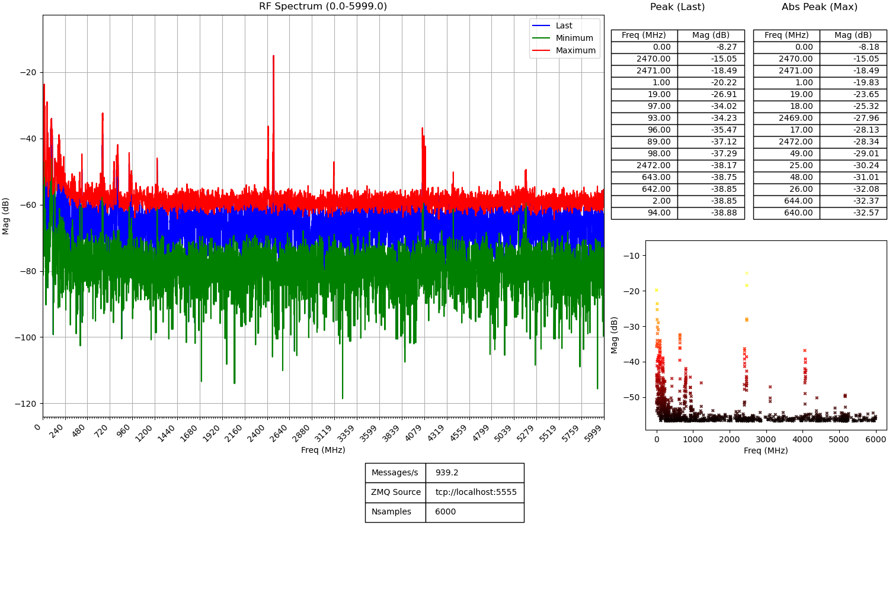

# HackRF Sweeper

> **A reimplementation of hackrf_sweep as a library: TSCM for Joe the plumber**




## Introduction

This is a refactoring or reimplementation of `hackrf_sweep` as a library, providing a carefully chosen API
to leverage the HackRF sweeping capabilities in a reusable, low-frustration fashion. The library provides
support for user-supplied callbacks to process raw transfer buffers or the already calculated FFT bins,
including a bypass mode to allow for entirely off-loading the data processing to the caller. It also
implements a rudimentary opaque mutex (locking) state for multi-thread applications.

A demo application is a re-implementation of the original `hackrf_sweep` tool as a CURVE-encrypted publisher
sending `msgpack` frames to any receivers subscribed to it. A companion demo application is included in
the form of a Python program that processes these frames and generates a real-time plot of the RF spectrum,
the last peak detections and the absolute peaks -maximum observed-.

Past projects attempting to provide similar capabilities include hackrf-spectrum-analyzer (https://github.com/pavsa/hackrf-spectrum-analyzer). `hackrf_sweeper` provides continuous sweeping support instead of one-shot sweeps, besides the aforementioned improvements.

We intend to design and develop a GNU Radio block related to this library.

## Highlights

 - Reusable state across multiple sweeps.
 - Ease of use for initialization and reconfiguration.
 - Support for user-supplied callbacks:
   - Raw USB transfer data access (with optional bypass mode disabling FFT processing).
   - *FFT bins ready* access.
 - Explicit error codes during configuration.
 - Support for external mutex APIs at the right places (better multi-thread tolerance).
 - Easy integration in third-party projects: minimal set of APIs needed to boot.
 - Developed with future merging into upstream hackrf in mind.

## Documentation

Pending deployment of CI with Github to generate and host HTML versions of the documentation, it can be generated like so:

```
$ cd docs/doxygen
$ doxygen Doxyfile
$ ls -ln
total 124
-rw-rw-r-- 1 2300 2300 116467 Sep 30 18:42 Doxyfile
drwxrwxr-x 3 2300 2300   4096 Sep 30 18:54 html
drwxrwxr-x 2 2300 2300   4096 Sep 30 18:54 latex
```

## Building

### Dependencies

The library depends on `libhackrf` and FFTW. The ZMQ demo application requires `libczmq` and `libzmq`.

For Debian users:

```
$ sudo apt-get install libhackrf-dev libczmq-dev libzmq5
```

### Compilation

Clone this repository:

```
$ git clone https://github.com/subreption/hackrf_sweeper.git
$ cd hackrf_sweeper
```

Proceed with the usual CMake build process:

```
$ mkdir build
$ cd build
-- The C compiler identification is GNU 13.2.0
-- The CXX compiler identification is GNU 13.2.0
-- Detecting C compiler ABI info
-- Detecting C compiler ABI info - done
-- Check for working C compiler: /usr/bin/cc - skipped
-- Detecting C compile features
-- Detecting C compile features - done
-- Detecting CXX compiler ABI info
-- Detecting CXX compiler ABI info - done
-- Check for working CXX compiler: /usr/bin/c++ - skipped
-- Detecting CXX compile features
-- Detecting CXX compile features - done
-- Release: git-ad6c10b
-- Found PkgConfig: /usr/bin/pkg-config (found version "1.8.1")
-- Checking for one of the modules 'fftw3'
-- Found LIBHACKRF: /usr/lib/x86_64-linux-gnu/libhackrf.so
(...)
-- Looking for include file pthread.h
-- Looking for include file pthread.h - found
-- Looking for pthread_create in pthreads
-- Looking for pthread_create in pthreads - not found
-- Looking for pthread_create in pthread
-- Looking for pthread_create in pthread - found
-- Found Threads: TRUE
-- Found FFTW: fftw3
-- Checking for module 'libczmq'
--   Found libczmq, version 4.2.1
-- Checking for module 'libzmq'
--   Found libzmq, version 4.3.5
-- CZeroMQ found: czmq
-- Msgpack found:
-- LibZMQ found: zmq
-- Using FFTW include directory: /usr/include
-- Using libhackrf include directory:
-- Configuring done (1.4s)
-- Generating done (0.0s)
-- Build files have been written to: (...)/hackrf_sweeper/build
$ make all
[ 16%] Building C object CMakeFiles/libhackrf_sweeper.dir/src/lib/sweep.c.o
[ 33%] Linking C static library liblibhackrf_sweeper.a
[ 33%] Built target libhackrf_sweeper
[ 50%] Building C object CMakeFiles/hackrf_sweeper.dir/src/tools/hackrf_sweeper.c.o
[ 66%] Linking C executable hackrf_sweeper
[ 66%] Built target hackrf_sweeper
[ 83%] Building C object CMakeFiles/hackrf_sweeper_zmqpub.dir/src/tools/hackrf_sweeper_zmqpub.c.o
[100%] Linking C executable hackrf_sweeper_zmqpub
[100%] Built target hackrf_sweeper_zmqpub
```

### Running the demo ZMQ application

The user must generate keys conforming to the modern ZMQ certificate format:

```
$ cat ../test-keys/server.key
#   ****  Generated on 2024-09-28 13:53:55 by CZMQ  ****
#   ZeroMQ CURVE Public Certificate
#   Exchange securely, or use a secure mechanism to verify the contents
#   of this file after exchange. Store public certificates in your home
#   directory, in the .curve subdirectory.

metadata
    generator = "hackrf_sweeper_zmq"
curve
    public-key = "x>fs%(=GAoN>OB/!%@a#UOwl+qXy]o!E7x61r/f."
```

Once the keys for the server have been generated, the demo application can run:

```
$ ./hackrf_sweeper_zmqpub -S ../test-keys/server.key
call hackrf_sample_rate_set(20.000 MHz)
call hackrf_baseband_filter_bandwidth_set(15.000 MHz)
I: 24-09-30 20:12:09 Applying certificate certificate...
Stop with Ctrl-C
1 total sweeps completed, 1.00 sweeps/second, 12800.00 KB/s
2 total sweeps completed, 1.00 sweeps/second, 13056.00 KB/s
4 total sweeps completed, 1.33 sweeps/second, 13056.00 KB/s
5 total sweeps completed, 1.25 sweeps/second, 13312.00 KB/s
6 total sweeps completed, 1.20 sweeps/second, 13056.00 KB/s
8 total sweeps completed, 1.33 sweeps/second, 13056.00 KB/s
^CCaught signal 2

Exiting...
Total sweeps: 0 in 6.82657 seconds (1.33 sweeps/second)
E: 24-09-30 20:12:16 Received NULL data from ring buffer
closing sweep
```
With `hackrf_sweeper_zmqpub` still running, the plotting demo application can be run like so:

```
$ ./demo/hackrf_sweeper_zmq2plot.py  -k ./test-keys
Client key pair found in ./test-keys
Listening for data from tcp://localhost:5555 with CURVE encryption...
```

## Reporting bugs

Please file an issue, or even better, provide a **tested** and **documented** PR. :-)

## Licensing

```
    Copyright 2024 Subreption LLC <research@subreption.com>

    This program is free software: you can redistribute it and/or modify
    it under the terms of the GNU General Public License as published by
    the Free Software Foundation, either version 3 of the License, or
    (at your option) any later version.

    This program is distributed in the hope that it will be useful,
    but WITHOUT ANY WARRANTY; without even the implied warranty of
    MERCHANTABILITY or FITNESS FOR A PARTICULAR PURPOSE.  See the
    GNU General Public License for more details.

    You should have received a copy of the GNU General Public License
    along with this program.  If not, see <https://www.gnu.org/licenses/>.
```
